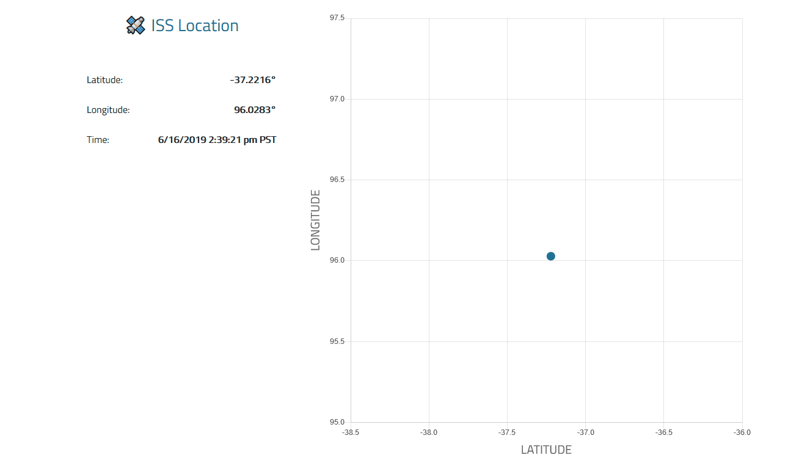

# 🛰️ ISS Position Tracker

A scatter plot showing the realtime location of the [International Space Station](https://en.wikipedia.org/wiki/International_Space_Station).



### Introduction
The Internation Space Station (ISS) was launched in 1998 and current orbits our planet 15.5 times a day at over 17,000 mph.  This app shows the realtime latitude and longitude of the ISS. It is built with [Node js](https://nodejs.org/en/), [Vue js](https://vuejs.org/) and [Socket IO](https://socket.io/).

### Installation

##### Server
```
cd server
npm install
node index
(Runs on port 3000)
```

##### Client
```
cd client
npm install
npm run serve
```
